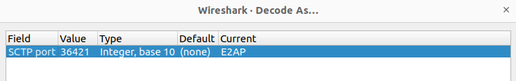

# FlexRIC

This repository contains [O-RAN Alliance](https://www.o-ran.org/) compliant E2 node Agent emulators, a NearRT-RIC, xApps written in C/C++, Python and Go. 
It implements O-RAN service models (KPM v2, KPM v3, and RC) and various customized service models (NG/GTP, PDCP, RLC, MAC, SLICE, TC) and a built-in emulation.
Depending on the service model, different encoding schemes have been developed (ASN.1, flatbuffer, plain).
The indication data received in the xApp uses SQLite3 or MySQL database to store the data for enabling offline processing applications
(e.g., ML/AI).
Moreover it supports E2AP v1.01/v2.03/v3.01 for all the SMs.

If you want to know more about FlexRIC and its original architecture, you can find more details at: Robert Schmidt, Mikel Irazabal, and Navid Nikaein. 2021.
FlexRIC: an SDK for next-generation SD-RANs. In Proceedings of the 17th International Conference on emerging Networking EXperiments and Technologies (CoNEXT
'21). Association for Computing Machinery, New York, NY, USA, 411–425. DOI: https://doi.org/10.1145/3485983.3494870. A pdf copy is available at
https://bit.ly/3uOXuCV 

---

## 1. Installation

### 1.1 Install prerequisites

- **A recent CMake (at least v3.22)**

  On Ubuntu, you might want to use [this PPA](https://apt.kitware.com/) to install an up-to-date version.

- **GCC version (at least v10)**

  > **NOTE: avoid using gcc-11**

- **SWIG (at least  v.4.1)**

  We use SWIG as an interface generator to enable the multi-language feature (i.e., C/C++ and Python) for the xApps. Please, check your SWIG version (i.e, `swig
  -version`) and install it from scratch if necessary as described here: https://swig.org/svn.html or via the code below:
  - Required dependencies for SWIG:
    ```bash
    sudo apt install autotools-dev automake libpcre2-dev yacc build-essential
    ```
  - Install SWIG:
    ```bash
    git clone https://github.com/swig/swig.git
    cd swig
    git checkout v4.1.1
    ./autogen.sh
    ./configure --prefix=/usr/
    make
    make install
    ```

- (Optional) Flatbuffer encoding. 
  
  We also provide a flatbuffers encoding/decoding scheme as alternative to ASN.1. In case you want to use it, follow the
  instructions at https://github.com/dvidelabs/flatcc and provide the path for the lib and include when selecting it at `ccmake ..` from the build directory 

### 1.2 Download the required dependencies.

- **Install common dependencies in Ubuntu:  (at least python3.8)**
  ```bash
  sudo apt install libsctp-dev python3 cmake-curses-gui python3-dev pkg-config libconfig-dev libconfig++-dev
  ```

- **Install MySQL as a storage for xApps:**
  ```bash
  sudo apt install libmysqlclient-dev mysql-server
  ```

- (Optional) Install websocket for proxy agent:
  ```bash
  sudo apt install libwebsockets-dev libjson-c-dev
  ```
  > Proxy agent has been tested with specific version of `libwebsockets-dev` and `libjson-c-dev`;
  cmake will check for that and promt an error in case the version you are trying to install is not compatible.

- (Optional) Install Go for xApp:
  ```bash
  sudo snap install go --channel=1.19/stable
  ```

- (Optional) Install Python ML xApp:
  ```
  sudo add-apt-repository -y ppa:deadsnakes/ppa
  sudo apt install libsnappy-dev python3.11 python3.11-dev
  ```
  
  
### 1.3 Clone the FlexRIC project, build and install it. 

- **Download the code**

  Check the [release page](https://gitlab.eurecom.fr/mosaic5g/flexric/-/releases) and read the release notes for deciding which release you want to install. You
  can download directly the code from the web or use git in the following way:

  ```bash
  # i.e.: 
  $ git clone https://gitlab.eurecom.fr/mosaic5g/flexric.git
  $ git checkout br-flexric
  ```

- **Build and install**

  List of options in CmakeList:
  - `E2AP_VERSION=E2AP_V1/E2AP_V2/E2AP_V3` (E2AP_V2 by default)
  - `KPM_VERSION=KPM_V2_01/KPM_V2_03/KPM_V3_00` (KPM_V3 by default)
  - `XAPP_DB=SQLITE3_XAPP/MYSQL_XAPP/NONE_XAPP` (MYSQL_XAPP by default)
  - `XAPP_PYTHON_SWIG=ON/OFF` (ON by default)
  - `XAPP_GO_SWIG=ON/OFF` (OFF by default)
  - `PROXY_AGENT=ON/OFF` (OFF by default)
   ```bash
   $ cd flexric
   $ mkdir build
   $ cd build
   $ cmake -D{your options} ..
   $ make -j
   $ sudo make install
   ```
  > By default the service model libraries will be installed in the path `/usr/local/lib/flexric` while the
  configuration files in `/usr/local/etc/flexric`. 


### 1.4 Unit Test (Optional step)

- Ctest
  ```bash
  cd build/
  ctest
  ```
- Service Model unit test
  ```bash
  cd build/test/sm
  # example: KPM
  cd sm/kpm_sm/kpm_sm_v03.00
  ./test_kpm_sm
  ```

### 1.5 Docker (optional step)

We build regularly FlexRIC using docker files for Ubuntu20 and Ubuntu22. You can find the Dockerfile at

```bash
cd test/docker/
```

---

## 2. Usage

The default configuration assumes all the components are located in the same localhost.

### 2.1 Steps to run
- Terminal1: start the nearRT-RIC
  ```bash
  $ /usr/local/bin/flexric/ric/nearRT-RIC
  ```
- Terminal2: start first E2-emulator:
  ```bash
  $ /usr/local/bin/flexric/e2agent/emu_agent_gnb
  ```
  > Note: you can run up multiple E2-emulators depends on your scenario, four different type E2-emulators are provided: `emu_agent_gnb`, `emu_agent_gnb_du`, `emu_agent_gnb_cu`, `emu_agent_enb`
- Terminal3: start monitoring ORAN service models xApp in C:
  ```bash
  $ /usr/local/bin/flexric/xApp/c/xapp_oran_moni -c /usr/local/etc/flexric/xapp_oran_sm.conf
  ```
- Terminal4: start monitoring ORAN service models xApp in Python:
  ```bash
  $ python3 /usr/local/lib/python3/dist-packages/monitor/xapp_oran_moni.py -c /usr/local/etc/flexric/xapp_oran_sm.conf
  ```
- (Optional) Terminal5: start monitoring customized service models xApp in Go:
  ```bash
  $ /usr/local/bin/flexric/xApp/go/go_xapp_cust_moni -c /usr/local/etc/flexric/xapp_cust_sm.conf
  ```
  
### 2.2 Configuration

> By default, without assigning any .conf file while running the executables (ex: `nearRT-RIC`, `emu_agent_gnb`) with flag `-c`, all the executables will use `/usr/local/etc/flexric/ric/ric.conf`.

- **configuration file for nearRT-RIC:**

  In `ric.conf`, we need to assign IP address for nearRT-RIC, and Port for both E2 and E42 interface:
  ```
  Name = "NearRT_RIC"
  NearRT_RIC_IP = "127.0.0.1"
  E2_Port = 36421
  E42_Port = 36422
  ```
- **configuration file for E2-emulator:**

  In `e2agent.conf`, we need to assign IP address to connect to nearRT-RIC, and Port for both E2 interface:
  ```
  Name = "E2_Agent"
  NearRT_RIC_IP = "127.0.0.1"
  E2_Port = 36421
  ```
- **configuration file for xApp:**

  In `xapp_cust_sm.conf`, `xapp_oran_sm.conf`, and `xapp_all_sm.conf`,
  we need to assign IP address to connect to nearRT-RIC, and Port for both E42 interface:
  ```
  Name = "xApp"
  NearRT_RIC_IP = "127.0.0.1"
  E42_Port = 36422
  ```
  To subscribe specific service models by xApp, the required info of service models are written in the config:
  - subscribe to customized service models:
    - supported name : MAC, RLC, PDCP, GTP, SLICE;
    - supported time: 1_ms, 2_ms, 5_ms, 10_ms, 100_ms, 1000_ms;
  - example in  `xapp_cust_sm.conf`:
    ```
     Sub_CUST_SM_List = (
         { name = "MAC", time = "100_ms" },
         { name = "RLC", time = "100_ms" },
         { name = "PDCP", time = "100_ms" }
     )
     ```
  - subscribe to ORAN service models:
    - supported name : KPM
    - supported time (ms): 1, 2, 5, 10, 100, 1000
    - supported format: 1, 4 
    - supported ran_type: ngran_gNB, ngran_gNB_CU, ngran_gNB_DU
  - example in `xapp_oran_sm.conf`:
    ```
    Sub_ORAN_SM_List = (
    { name = "KPM", time = 1000,
      format = 4,
      ran_type = "ngran_gNB",
      actions = (
            { name = "DRB.PdcpSduVolumeDL" },
            { name = "DRB.PdcpSduVolumeUL" },
            { name = "DRB.RlcSduDelayDl" },
            { name = "DRB.UEThpDl" },
            { name = "RRU.UEThpUl" },
            { name = "RRU.PrbTotDl" },
            { name = "RRU.PrbTotUl" }
            )
    },
    { name = "KPM", time = 1000,
      format = 4,
      ran_type = "ngran_gNB_DU",
      actions = (
            { name = "DRB.RlcSduDelayDl" },
            { name = "DRB.UEThpDl" },
            { name = "RRU.UEThpUl" },
            { name = "RRU.PrbTotDl" },
            { name = "RRU.PrbTotUl" }
            )
    },
    { name = "KPM", time = 1000,
      format = 4,
      ran_type = "ngran_gNB_CU",
      actions = (
            { name = "DRB.PdcpSduVolumeDL" },
            { name = "DRB.PdcpSduVolumeUL" }
            )
    }
    )
    ```
  To configure database:

  - example by default:
  ```
  xApp_DB = {
      enable = "ON"
      ip = "127.0.0.1"
      dir = "/tmp/"
      filename = "testdb"
      username = "xapp" # if using mysql
      password = "eurecom" # if using mysql
  }
  ```
  - if you want to disable using database while running the specific xApp:
  ```
  xApp_DB = {
      enable = "OFF"
  }
  ```

### 2.3 Wireshark
Configure the preference for the port number of E2AP protocol to be able see the E2 message between E2-emulator and nearRT-RIC.
[to be completed, not yet updated]

At this point, FlexRIC is working correctly in your computer and you have already tested the multi-agent, multi-xApp and multi-language capabilities.

The latency that you observe in your monitor xApp is the latency from the E2 Agent to the nearRT-RIC and xApp. In modern computers the latency should be less than 200 microseconds or 50x faster than the O-RAN specified minimum nearRT-RIC latency i.e., (10 ms - 1 sec) range.
Therefore, FlexRIC is well suited for use cases with ultra low-latency requirements.
Additionally, all the data received in the xApp is also written to /tmp/xapp_db in case that offline data processing is wanted (e.g., Machine
Learning/Artificial Intelligence applications). You browse the data using e.g., sqlitebrowser.
Please, check the example folder for other working xApp use cases.

## 3. Integration with RAN and example of deployment

### 3.1 Integration with OpenAirInterface 5G RAN

Follow the instructions https://gitlab.eurecom.fr/oai/openairinterface5g/-/blob/develop/openair2/E2AP/README.md


### 3.2 Integration with srsRAN 5G RAN

Follow the instructions https://docs.srsran.com/projects/project/en/latest/tutorials/source/flexric/source/index.html 

### 3.3 Integration with Keysight RICtest 

The nearRT-RIC has been successfully tested with Keysight's RICtest RAN emulator https://www.keysight.com/us/en/product/P8828S/rictest-ran-intelligent-controller-test-solutions.html, 
as demonstrated at O-RAN PlugFest Fall 2023. Specifically, the nearRT-RIC with the xApp `flexric/examples/xApp/c/keysight/xapp_keysight_kpm_rc.c` were tested.

### 3.4 (opt) Synchronize clock

Before running the various components (RAN/nearRT-RIC/xApps), you probably want to align the machines' clock. For this aim, you can use `ptp4l` in all the machines
involved (if you have for example deployed the various components on different hosts)

```bash
sudo ptp4l -m -i InterfaceName #for master
sudo ptp4l -m -i InterfaceName -s #for slaves
```


Following make sure that no ntpd, chrondy or timesyncd is running in the system (e.g., `sudo systemctl stop systemd-timesyncd`). 

```bash
sudo phc2sys -m -s InterfaceName -w
```


### 3.5 Start the processes

* Start some gNodeB

  Below an example with 5G OAI gNodeB
  ```bash
  # gNB
  $ cd oai/cmake_targets/ran_build/build
  $ sudo ./nr-softmodem -O ../../../targets/PROJECTS/GENERIC-NR-5GC/CONF/gnb.sa.band78.fr1.106PRB.usrpb210.conf --rfsim --sa -E
  ```

* Start the nearRT-RIC

  ```bash
  $ ./build/examples/ric/nearRT-RIC
  ```

* Start different xApps

  * start the KPM monitor xApp
    At the moment, the following measurements are supported:
    * "DRB.PdcpSduVolumeDL"
    * "DRB.PdcpSduVolumeUL"
    * "DRB.RlcSduDelayDl"
    * "DRB.UEThpDl"
    * "DRB.UEThpUl"
    * "RRU.PrbTotDl"
    * "RRU.PrbTotUl"
    
  ```bash
  $ ./build/examples/xApp/c/monitor/xapp_kpm_moni
  ```

  * start the RC monitor xApp - aperiodic subscription support for "UE RRC State Change"
  ```bash
  $ ./build/examples/xApp/c/monitor/xapp_rc_moni
  ```

  * start the RC control xApp - RAN control function "QoS flow mapping configuration" support, i.e. creating a new DRB
  ```bash
  $ ./build/examples/xApp/c/kpm_rc/xapp_kpm_rc
  ```

  * start the (MAC + RLC + PDCP + GTP) monitor xApp
  ```bash
  $ ./build/examples/xApp/c/monitor/xapp_gtp_mac_rlc_pdcp_moni
  ```
  
  The controlling sequence diagram is represented below:

  


## 4. Integration with other nearRT-RICs 

### 4.1 O-RAN OSC nearRT-RIC

FlexRIC's E2 Agent (and OAI RAN that is embedded on it) has also been successfully tested using O-RAN's OSC nearRT-RIC H Release as shown at https://openairinterface.org/news/openairinterface-will-showcase-3-demos-at-the-o-ran-f2f-meeting-in-phoenix/ and https://openairinterface.org/joint-osc-oai-workshop-end-to-end-open-source-reference-designs-for-o-ran/ 

Follow OSC nearRT-RIC installation guide. The xApp can be found at https://github.com/mirazabal/kpm_rc-xapp. Please, note that we do not give support for the OSC nearRT-RIC.  

Recorded presentation at Phoenix, October 2023 (4th minute): https://zoom.us/rec/play/N5mnAQUcEVRf8HN6qLYa4k7kjNq3bK4hQiYqHGv9KUoLfcR6GHiE-GvnmAudT6xccmZSbkxxYHRwTaxk.Zi7d8Sl1kQ6Sk1SH?canPlayFromShare=true&from=share_recording_detail&continueMode=true&componentName=rec-play&originRequestUrl=https%3A%2F%2Fzoom.us%2Frec%2Fshare%2FwiYXulPlAqIIDY_vLPQSGqYIj-e5Ef_UCxveMjrDNGgXLLvEcDF4v1cmVBe8imb4.WPi-DA_dfPDBQ0FH

## 5. Support/further resources

* Mailing list: if you need help or have some questions, you can subscribe to the mailing list `techs@mosaic-5g.io` that you can find at
  https://gitlab.eurecom.fr/mosaic5g/mosaic5g/-/wikis/mailing-lists. The emails are archived and available publicly. 
* [Demo](DEMO.md) for flexric in July 2022
* [The Wiki space](https://gitlab.eurecom.fr/mosaic5g/flexric/-/wikis/home) contains tutorials and presentations
* [Original FlexRIC paper ACM CoNEXT 2021](https://bit.ly/3uOXuCV)

## 6. OAM Project Group & Roadmap

Check https://openairinterface.org/projects/oam-project-group/

## 7. FlexRIC Milestone

Check on https://gitlab.eurecom.fr/mosaic5g/flexric/-/milestones and in https://openairinterface.org/mosaic5g/
