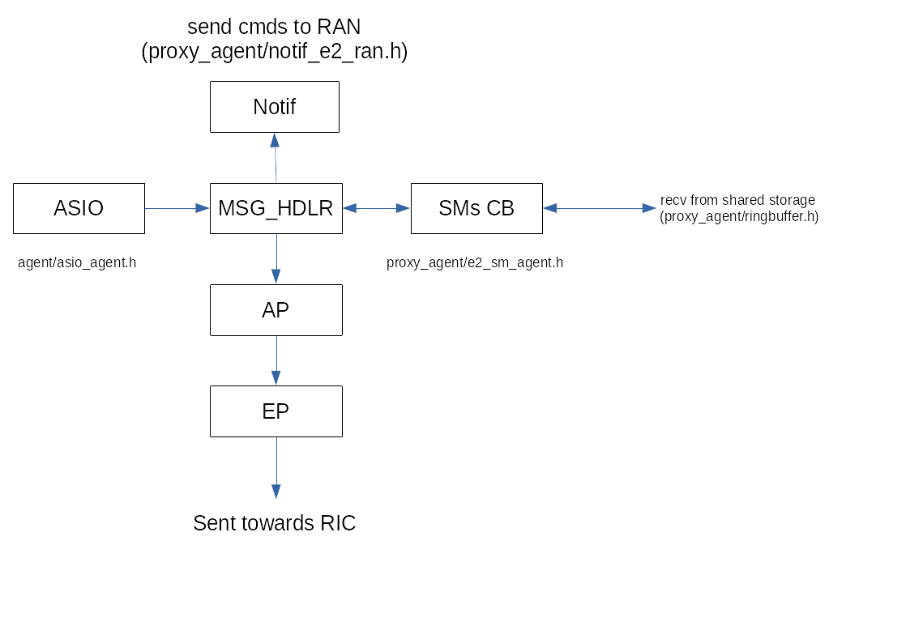
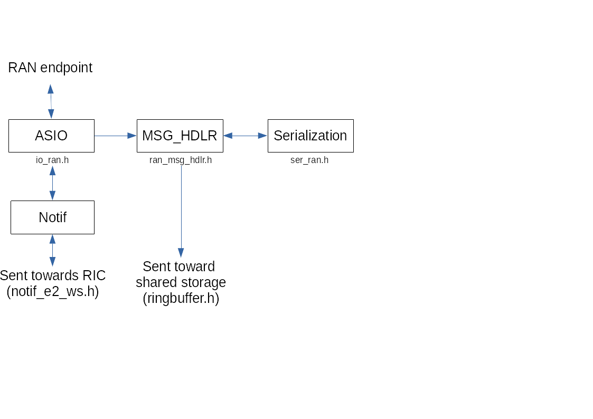
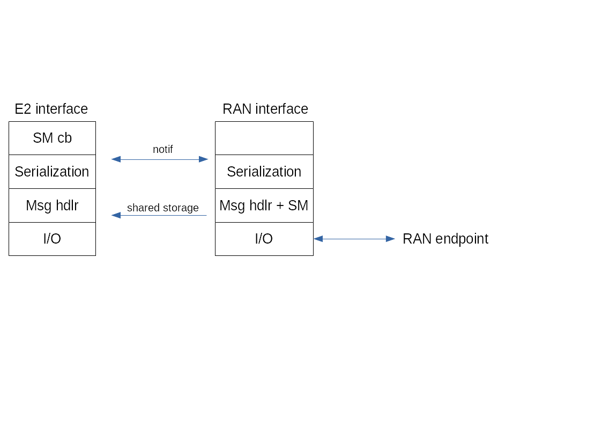

# Design of the proxy agent

## Proxy agent software decomposition

Below the communication between RIC and proxy agent with the interfaces E2/RAN/E42 involved is depicted.

Details on proxy agent E2 interface interactions

 
Details on proxy agent RAN interface described by an abstract interface in ran_if.h:

 

Functional decomposition:

Note that RAN does not have a SM block. its functionality is embedded for the moment into the `msg_handler` block.

For the moment with have just one RAN I/O module implementation that is based on Websockets. 
The detailed RAN I/O module composition for the various implementations is the one below, where the module implementations are: 
use case websocket(1): WS/TCP/ASIO/socket, use case REST api(2): REST/HTTP/TCP/ASIO/socket, use case File api(3): ASIO/File

| 1  |  2   |  3  |
|:--:|:----:|:---:|
| WS | REST | None|
|None| HTTP| None |
| TCP| TCP | None |
|ASIO|ASIO | ASIO |
| Socket | Socket | File |